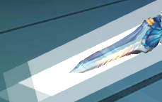
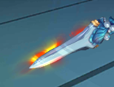

# RenterTexture + AlphaBlend
解决Unity粒子在使用AlphaBlend模式时，在摄像机拍摄渲染RenderTexture时与相机背景融合问题

  

原 [UGUI研究院之在UI上使用RenderTexture显示模型+AlphaBlend特效（二十五）](http://www.xuanyusong.com/archives/4318)
有一个解决方案，但是实测效果非常非常不理想，位置对不上，尤其是当模型和特效需要显示在一个透明背景上时，几乎是无解的。


故，另辟蹊径，参考[AnimationToPNG](http://wiki.unity3d.com/index.php/AnimationToPNG)
设计思路：

*Blend SrcAlpha OneMinusSrcAlpha // Traditional transparency*
```shader
颜色混合方程式：C = Cs*scrA + Cd*(1-srcA) //式1

//如果，在相机渲染时，分别设置相机的背景为 Cd=(0,0,0,1) 和 Cd=(1,1,1,1)
//就可以得到两个C，分别为Cblack, Cwhite, 即：

Cblack = Cs*srcA + (0,0,0)*(1-srcA) = Cs*srcA //式2
Cwhite = Cs*srcA + (1,1,1)*(1-srcA) = Cblack + (1,1,1)*(1-srcA) //式3

//即：
Cwhite.r = Cblack.r + (1-srcA) //式4
srcA = 1 - (Cwhite.r-Cblack.r) //式5

//此处求得原Alpha, 带入上 //式2
Cs = Cblack/srcA

```

以上即可完整得到完整的渲染图，避免重现对位置，单对不同的混合就又尴尬了，需要重新计算

附上一个自动创建RenderTexture的脚本：[GRender](GRender.cs)，需配合[GRenderShader](GRenderShader.shader)一起使用

以及原代码 [AnimationToPNG](AnimationToPNG.cs)

